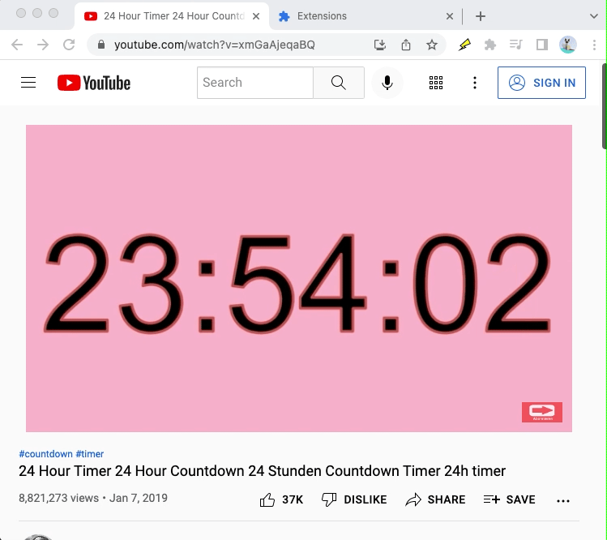

# Actions

Browser action to run actions on the page; made with [create-extension](https://www.npmjs.com/package/create-extension)

## Author

[Albert Patterson](mailto:albert.patterson.code@gmail.com)

- [Linkedin](https://www.linkedin.com/in/apattersoncmu/)
- [Github](https://github.com/albertpatterson)
- [npm](https://www.npmjs.com/~apatterson189)
- [Youtube](https://www.youtube.com/channel/UCrECEffgWKBMCvn5tar9bYw)
- [Medium](https://medium.com/@albert.patterson.code)

## Installation

- Clone this repository
- `npm install`
- `npm run build-dev`
- [Load an unpacked extension](https://developer.chrome.com/docs/extensions/mv3/getstarted/#unpacked)
